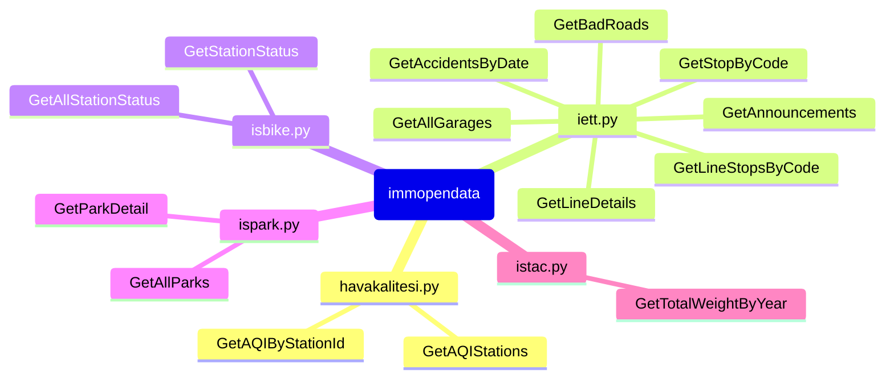

# tdk

```mermaid
mindmap
  root(immopendata)
    havakalitesi.py    
        GetAQIStations
        GetAQIByStationId
    iett.py
        GetStopByCode
        GetAllGarages
        GetAnnouncements
        GetBadRoads
        GetAccidentsByDate
        GetLineStopsByCode
        GetLineDetails
    isbike.py
        GetStationStatus
        GetAllStationStatus
    ispark.py
        GetAllParks
        GetParkDetail
    istac.py
        GetTotalWeightByYear
```
